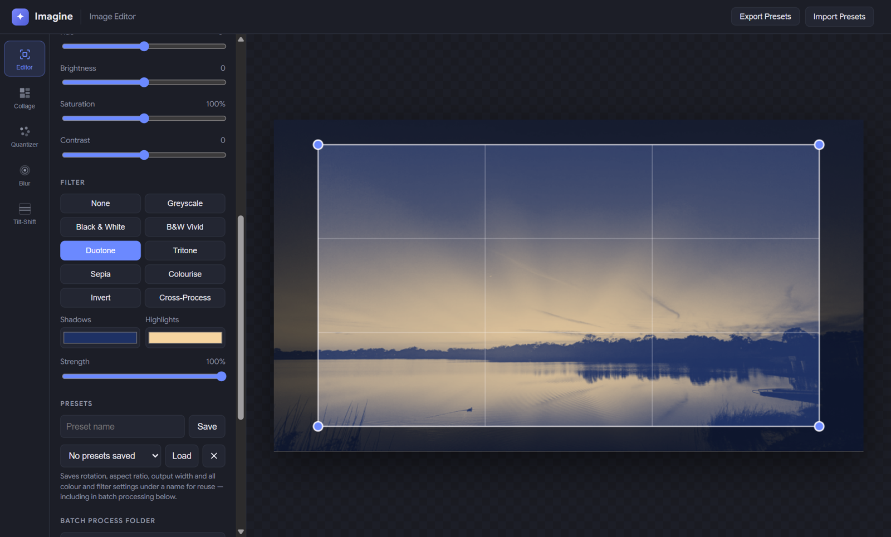
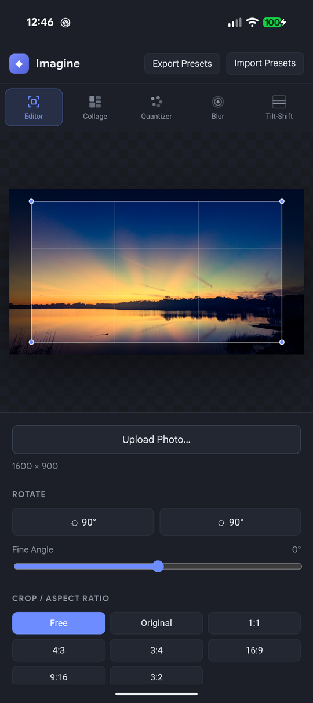
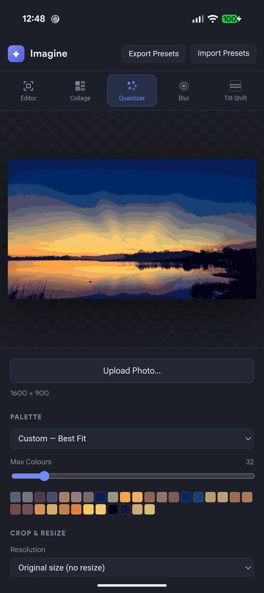
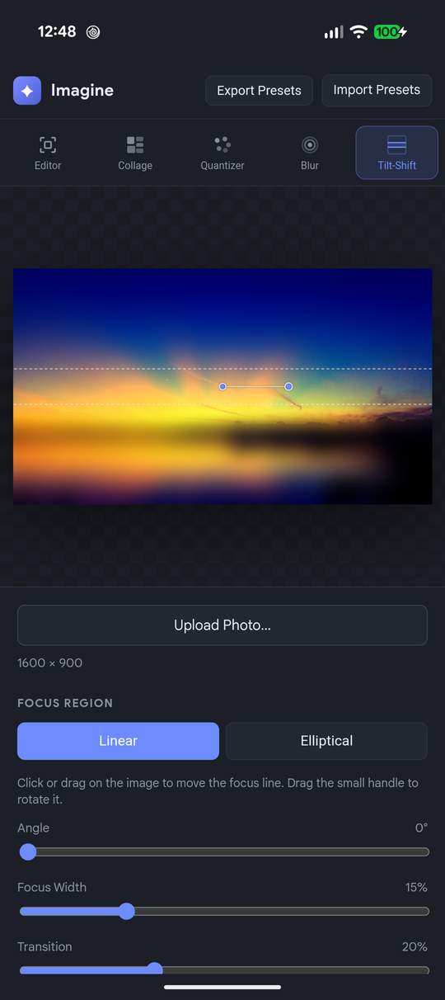
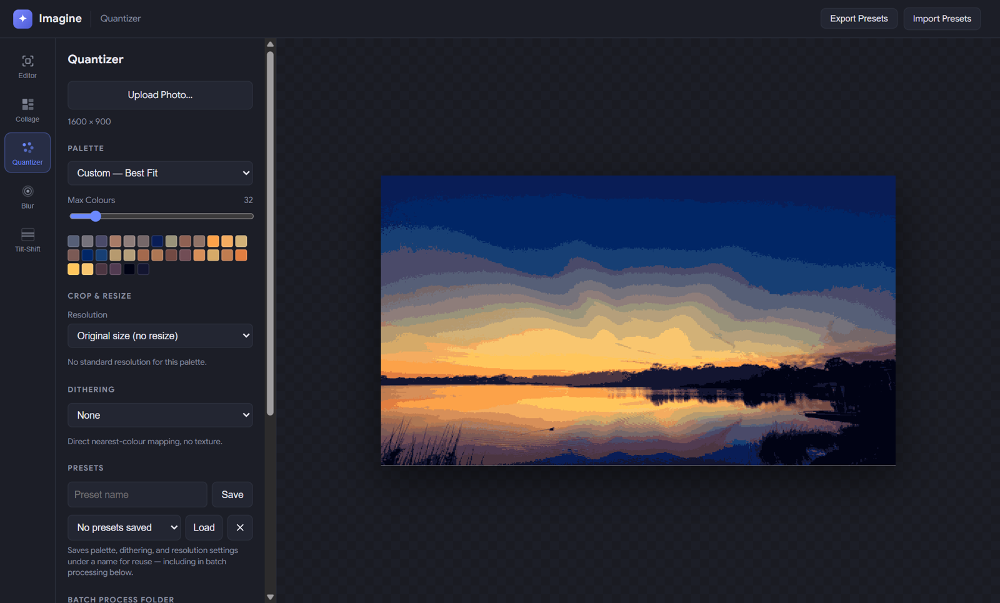
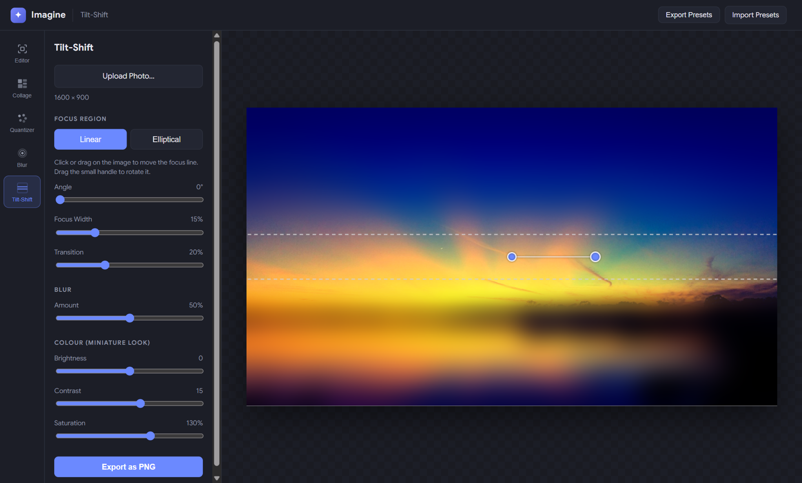

# Imagine

Five image tools in a single HTML page: an editor, a collage maker, a retro palette quantizer, a blur tool and a tilt-shift miniature effect. Everything runs locally in the browser, so photos never leave your device. It's packaged for the web (Docker + nginx, installable as a PWA), Windows desktop (Electron) and Android (Capacitor).

<p align="center">
  
</p>

<p align="center">
  
  &nbsp;
  
  &nbsp;
  
</p>

## Tools

- **Image Editor**: rotate (90° steps plus a fine angle), crop freely or to a fixed aspect ratio (original, 1:1, 4:3, 3:4, 16:9, 9:16, 3:2), set the output size, and adjust hue, brightness, saturation and contrast. Colour filters: greyscale, black & white, B&W vivid, duotone and tritone (with your choice of colours), sepia, colourise (an overall tint), invert and cross-process, each with adjustable strength.
- **Collage Maker**: lays out a folder of photos at any output size, with adjustable gaps, an optional coloured border, optional random rotation, and a shuffle button for a new layout. It can include subfolders, and can take a random 1, 2, 4, 8, 16 or 32 images from each folder. With a number picked, a shuffle also picks a new set.
- **Quantizer**: reduces a photo to a retro palette, either B&W (1-bit), Commodore 64, CGA, EGA, VGA, Amiga EHB and HAM, or a custom best-fit palette of up to 256 colours. Seven dithering modes are available, including Floyd–Steinberg and 8×8 Bayer.
- **Image Blur**: Gaussian, box or hexagonal blur at an adjustable strength.
- **Tilt-Shift**: a linear or elliptical focus region you drag and rotate on the image, with blur amount and miniature-look colour settings.

The Editor, Quantizer and Blur tools also have:

- **Presets**: save settings under a name. **Export Presets** and **Import Presets** in the top bar back up all tools' presets to one JSON file and bring them back.
- **Batch processing**: apply a preset to a whole folder of photos. Each result is saved as soon as it's processed.

<p align="center">
  
  &nbsp;
  
</p>

## Project layout

| Path | What it is |
|---|---|
| `imagine.html` | The whole app: markup, styles and script |
| `manifest.webmanifest`, `pwa.js`, `sw.js`, `icons/` | PWA install, offline service worker and icons |
| `Dockerfile`, `nginx.conf` | Web deployment: nginx serving the app on port 80 |
| `electron/` | Electron main process and icon generator |
| `android/` | Capacitor Android project, including the native save plugin |
| `build/icon.png` | App icon used by the desktop builds |

## Running locally

Any static file server works, for example:

```sh
npx http-server -p 8765
```

Then open <http://localhost:8765/imagine.html>.

## Web deployment (Docker)

```sh
docker build -t imagine:latest .
docker run -d --name Imagine --restart unless-stopped -p 8080:80 imagine:latest
```

The container serves plain HTTP. Browsers only install PWAs and run service workers over HTTPS (or on `localhost`), so put it behind a TLS reverse proxy if you want those outside your own machine.

## Desktop (Electron)

```sh
npm install
npm start          # run in development
npm run dist       # build installers into dist/
```

On Windows this produces an NSIS installer and a portable `.exe`. The build config also has macOS (`dmg`) and Linux (`AppImage`) targets.

Exports and batch output save straight to your Downloads folder, as they would in a browser, rather than asking where to save each image.

## Android

Requires Android Studio (for its JDK) and the Android SDK. Set `JAVA_HOME` to Android Studio's bundled `jbr`, and point Gradle at the SDK with `ANDROID_HOME` or `android/local.properties` (`sdk.dir=...`).

```sh
npm install
npm run android:sync          # copies the app into www/ and syncs Capacitor
cd android
./gradlew assembleRelease bundleRelease
```

Outputs land in `android/app/build/outputs/apk/release/` and `android/app/build/outputs/bundle/release/`.

Release signing reads `android/keystore.properties` (gitignored):

```properties
storeFile=<path to your .jks keystore>
storePassword=...
keyAlias=...
keyPassword=...
```

Without it, release builds are produced unsigned.

Install on a connected device with `adb install -r android/app/build/outputs/apk/release/app-release.apk`.

What's different on Android:

- **Saving**: an Android WebView can't download files, so a small native plugin (`ImagineFilesPlugin`) saves them instead. Images go to **Pictures/Imagine**, where they appear in your gallery. Preset exports go to **Download/Imagine**.
- **Batch and collage sources**: Android has no folder picker for web content, so **Select Folder…** becomes **Select Photos…**, a multi-select photo picker. The Collage Maker treats the picked photos as one folder, so **Images per Folder** takes that many at random from the selection.
- **Layout**: on narrow screens the tools move to a row across the top, with the image above the controls.

## Regenerating icons

`icons/icon.svg` is the source artwork. After changing it, update `draw()` in `electron/make-icon.js` to match, then run:

```sh
npm run icon
```

This rewrites `build/icon.png` and the Android launcher icons. The PNGs in `icons/` used by the PWA are separate files.

## License

[MIT](LICENSE) © 2026 Andrew Rigney
